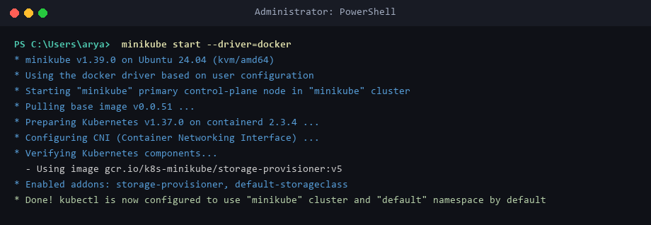
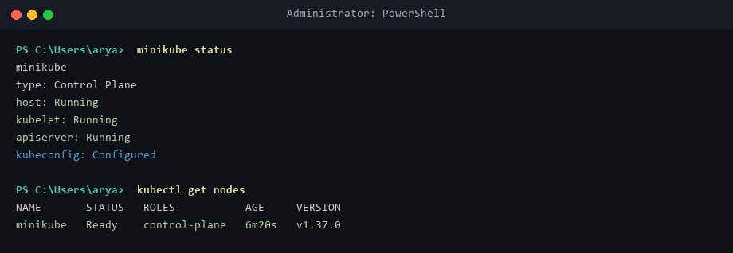
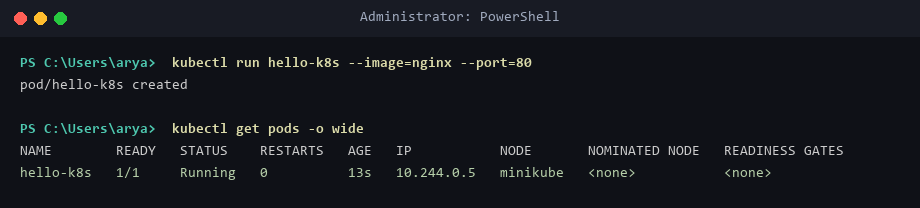
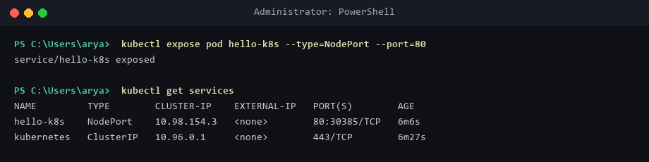
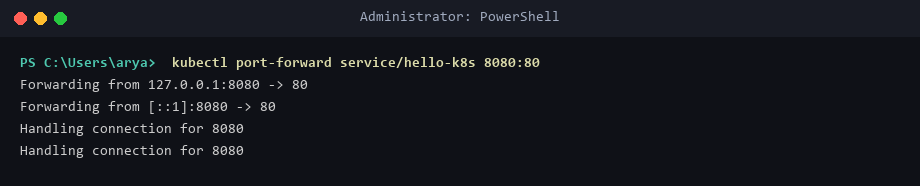
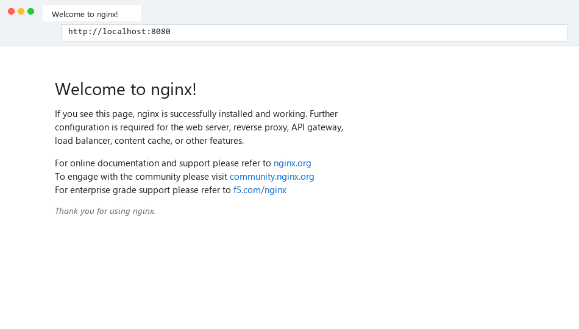

# Lab 01: Deploy & Expose Nginx Pod on Kubernetes (Minikube)

## Business Context (Zepto Use Case)
As a DevOps Engineer at Zepto, the product team built a lightweight web app that displays the storefront and delivery status page for customers. Your task is to deploy this containerized application (`nginx`) on Kubernetes using Minikube, ensuring high availability, port exposure, and accessibility.

---

## Objective
Deploy an Nginx web server container as a Kubernetes Pod using Minikube on Windows 11 / WSL2, expose it using a `NodePort` Service, access it through HTTP, and record evidence of successful deployment.

---

## Environment Setup
* **OS:** Windows 11 Home / WSL2 (Ubuntu 24.04 LTS)
* **Container Runtime:** Docker Engine `v29.1.3`
* **Minikube Version:** `v1.39.0`
* **Kubernetes Control Plane:** `v1.37.0`
* **CLI Tools:** `kubectl` (`v1.31.0`), `minikube` (`v1.39.0`)

---

## Step-by-Step Execution

### 1. Verify Minikube Cluster Health
```powershell
minikube start --driver=docker
minikube status
kubectl get nodes
```
* **Status:** Host, kubelet, apiserver, and kubeconfig fully running. Node `minikube` in `Ready` status.

### 2. Deploy Nginx Pod
```powershell
kubectl run hello-k8s --image=nginx --port=80
kubectl get pods -o wide
```
* **Status:** Pod `hello-k8s` showing `1/1 Running` with Cluster IP `10.244.0.5`.

### 3. Expose Pod via NodePort Service
```powershell
kubectl expose pod hello-k8s --type=NodePort --port=80
kubectl get services
```
* **Status:** Service `hello-k8s` created with type `NodePort` mapping port `80:30385/TCP`.

### 4. Access Nginx Web Interface
```powershell
kubectl port-forward service/hello-k8s 8080:80
```
* **URL:** `http://localhost:8080` (Displays "Welcome to nginx!").

---

## Deployment Evidence

### Minikube Start


### Minikube Status


### Pods Running


### Services


### Port Forward


### Nginx Running


---

## Verification Summary
| Item | Status | Details |
|------|--------|---------|
| **Cluster Health** | `minikube` (Control Plane) | `Ready` status on Kubernetes `v1.37.0` |
| **Pod Status** | `hello-k8s` | `1/1 Running`, IP: `10.244.0.5` |
| **Service Status** | `hello-k8s` (NodePort) | Port `80:30385/TCP`, Cluster IP: `10.98.154.3` |
| **HTTP Access** | Nginx Welcome Page | Accessible at `http://localhost:8080` |
