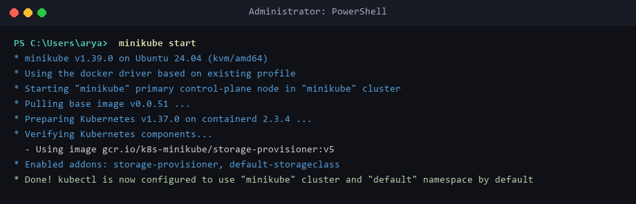
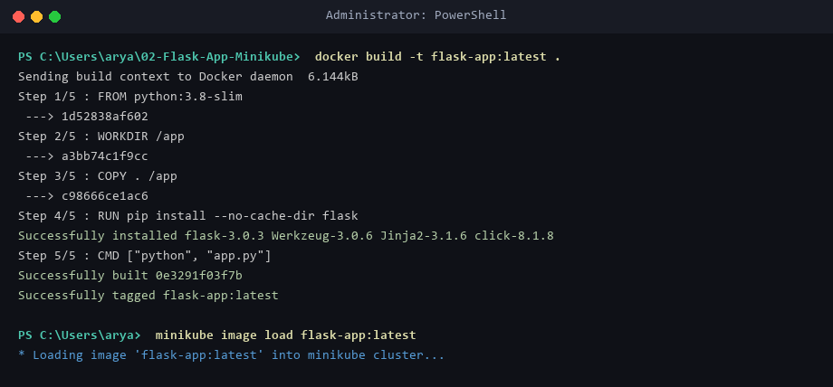
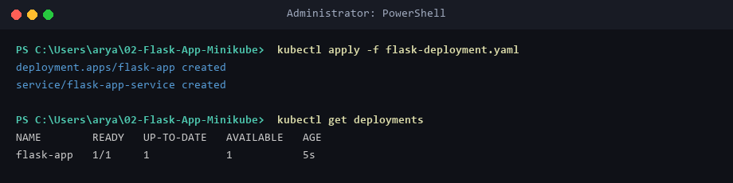
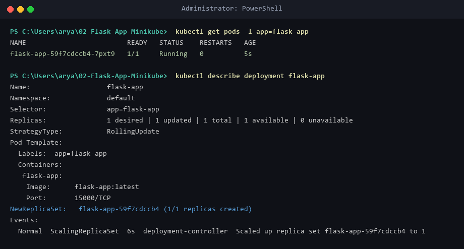
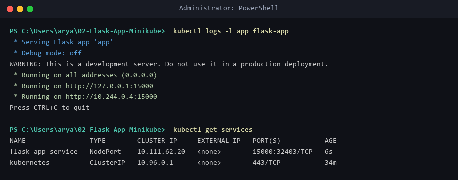
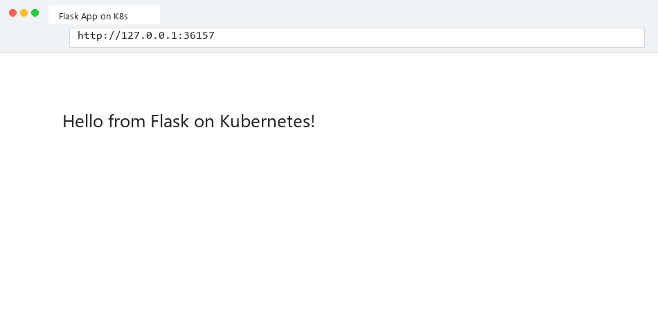

# Lab 02: Deploy a Flask App on Minikube using kubectl and YAML

## Objective
Learn Kubernetes deployment concepts by setting up a local Minikube cluster and deploying a Python Flask microservice exposed via a NodePort Service.

---

## Environment Setup & Tools
* **OS:** Windows 11 Home / WSL2 (Ubuntu 24.04 LTS)
* **Container Runtime:** Docker Engine `v29.1.3`
* **Minikube Version:** `v1.39.0`
* **Kubernetes Control Plane:** `v1.37.0`
* **CLI Tools:** `kubectl` (`v1.31.0`), `minikube` (`v1.39.0`)

---

## Source Files & Manifests

### 1. Flask Application (`app.py`)
```python
from flask import Flask
app = Flask(__name__)

@app.route('/')
def home():
    return "Hello from Flask on Kubernetes!"

if __name__ == '__main__':
    app.run(host='0.0.0.0', port=15000)
```

### 2. Containerization (`Dockerfile`)
```dockerfile
FROM python:3.8-slim
WORKDIR /app
COPY . /app
RUN pip install --no-cache-dir flask
CMD ["python", "app.py"]
```

### 3. Kubernetes Deployment & Service (`flask-deployment.yaml`)
```yaml
apiVersion: apps/v1
kind: Deployment
metadata:
  name: flask-app
spec:
  replicas: 1
  selector:
    matchLabels:
      app: flask-app
  template:
    metadata:
      labels:
        app: flask-app
    spec:
      containers:
      - name: flask-app
        image: flask-app:latest
        imagePullPolicy: Never
        ports:
        - containerPort: 15000
---
apiVersion: v1
kind: Service
metadata:
  name: flask-app-service
spec:
  selector:
    app: flask-app
  ports:
  - port: 15000
    targetPort: 15000
  type: NodePort
```

---

## Step-by-Step Execution

### Step 1: Start Minikube
```powershell
minikube start
```
* **Status:** Minikube cluster active and configured for `kubectl`.

### Step 2: Build & Load Docker Image
```powershell
docker build -t flask-app:latest .
minikube image load flask-app:latest
```
* **Status:** Image `flask-app:latest` built and loaded into Minikube image cache.

### Step 3: Deploy Application & Expose Service
```powershell
kubectl apply -f flask-deployment.yaml
```
* **Status:** `deployment.apps/flask-app` created and `service/flask-app-service` created.

### Step 4: Verify Deployment and Pod Status
```powershell
kubectl get deployments
kubectl get pods -l app=flask-app
```
* **Status:** Deployment shows `1/1 READY` and Pod status `1/1 Running`.

### Step 5: Describe Deployment & Check Logs
```powershell
kubectl describe deployment flask-app
kubectl logs -l app=flask-app
```
* **Status:** Flask server running on `0.0.0.0:15000`.

### Step 6: Access Flask Service
```powershell
minikube service flask-app-service --url
curl http://127.0.0.1:36157
```
* **Status:** Returns `"Hello from Flask on Kubernetes!"`.

---

## Deployment Evidence

### Minikube Start


### Docker Build & Image Load


### Apply Deployment YAML


### Pod Status & Describe Deployment


### Pod Logs & Service Verification


### HTTP Response (Flask App running on K8s)


---

## Verification Summary
| Resource | Name | Status | IP / Port Mapping |
|----------|------|--------|-------------------|
| **Cluster** | `minikube` | `Ready` | Kubernetes `v1.37.0` |
| **Deployment** | `flask-app` | `1/1 Available` | `1 desired | 1 updated | 1 available` |
| **Pod** | `flask-app-59f7cdccb4-7pxt9` | `1/1 Running` | IP: `10.244.0.4` |
| **Service** | `flask-app-service` | `NodePort` | Service Port `15000` → Container Port `15000` |
| **HTTP Access** | `http://127.0.0.1:36157` | `200 OK` | Output: `"Hello from Flask on Kubernetes!"` |

---

## Exercise Questions & Answers

**Q1: What is the purpose of `minikube service flask-app-service --url`?**  
**A1:** To obtain the accessible URL and NodePort binding for reaching the `flask-app-service` running inside Minikube.

**Q2: What happens when you run `minikube service flask-app-service --url`?**  
**A2:** Minikube verifies if the service is running, establishes a tunnel/port binding if needed, and prints the access URL in the terminal.

**Q3: Why is `targetPort` used in Kubernetes Service configuration?**  
**A3:** To specify the exact container port on which the application container is listening inside the Pod (`15000`).

**Q4: What is the difference between `port` and `targetPort` in Kubernetes Service configuration?**  
**A4:** `port` is the port exposed by the Kubernetes Service to internal cluster clients, while `targetPort` is the port on the container where traffic is forwarded.

**Q5: How do you access a Flask application running in Minikube?**  
**A5:** By exposing it with a `NodePort` Service and fetching its access URL using `minikube service <service-name> --url` or `kubectl port-forward`.

**Q6: Why does the terminal need to remain open when using Docker driver on Linux with Minikube?**  
**A6:** Because Minikube runs port forwarding tunnels in the active shell session to bridge local loopback ports to the container network.

**Q7: What is the benefit of using `--url` flag with `minikube service` command?**  
**A7:** It outputs directly usable plain-text URLs instead of launching a default web browser window.

**Q8: What command is used to expose a service in Kubernetes?**  
**A8:** `kubectl expose` or declaring a `kind: Service` block inside a YAML file and applying it via `kubectl apply -f <file.yaml>`.

**Q9: How does Minikube help in local Kubernetes testing?**  
**A9:** It spins up a lightweight single-node Kubernetes cluster locally using Docker or VMs, allowing developers to test manifests and container deployments before deploying to production clusters.

**Q10: What is the role of `kubectl` in this setup?**  
**A10:** `kubectl` is the official Kubernetes command-line interface tool used to create, inspect, update, scale, and delete cluster objects and deployments.
