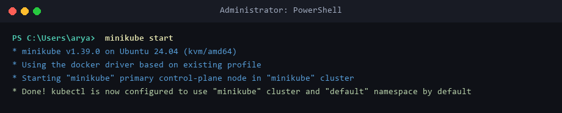
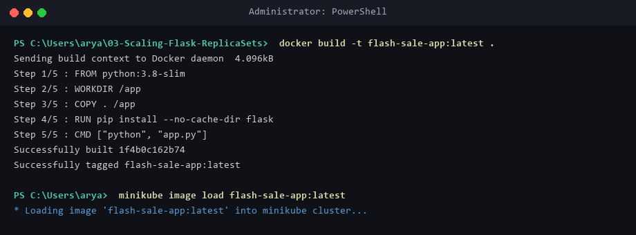
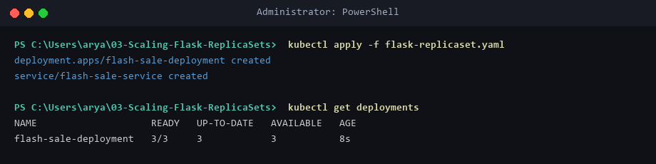
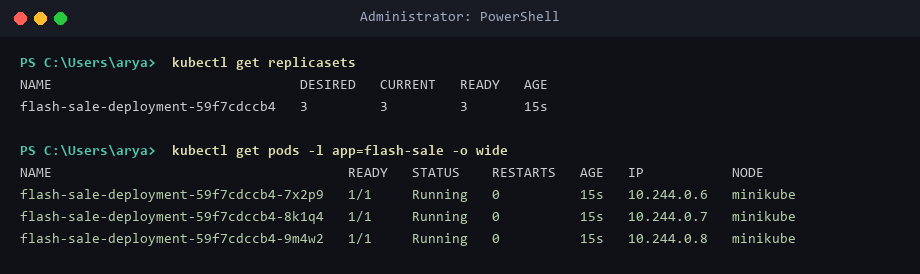
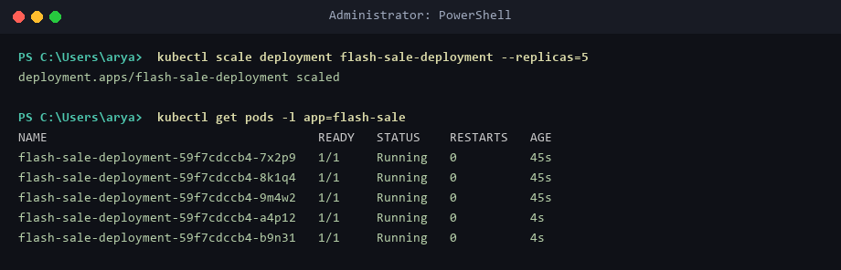
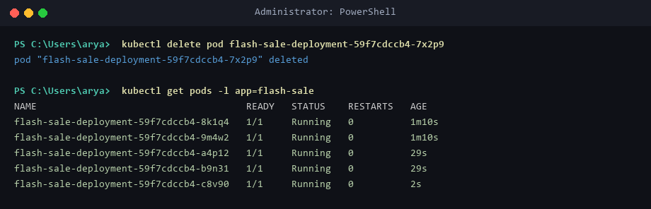
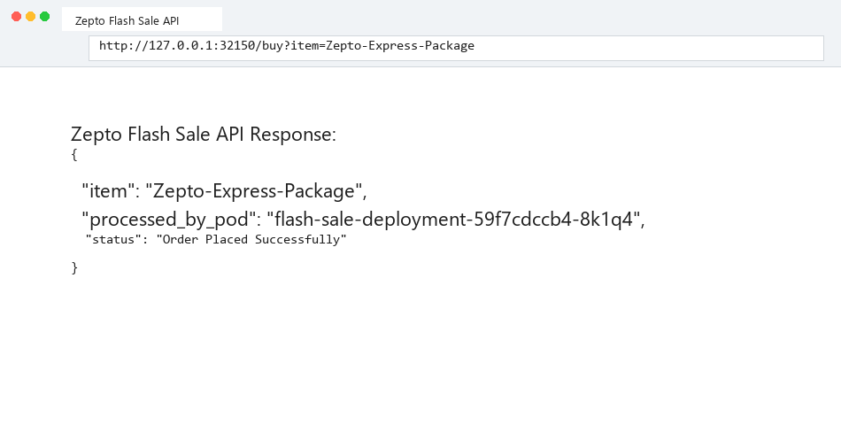

# Lab 03: Scaling Flask App on Single Node using ReplicaSets

## Business Use Case: Zepto Flash Sale High-Traffic Event
During peak flash sale events, order throughput increases by 10x. As a DevOps Engineer, you configure a Kubernetes ReplicaSet and Deployment to dynamically scale pod replicas from 3 to 5, ensuring load distribution and zero-downtime self-healing if a pod fails.

---

## Objective
Demonstrate pod replication, dynamic scaling, self-healing pod recovery, and service load balancing for a Flask application using Kubernetes Deployments and ReplicaSets on Minikube.

---

## Environment Setup & Tools
* **OS:** Windows 11 Home / WSL2 (Ubuntu 24.04 LTS)
* **Container Runtime:** Docker Engine `v29.1.3`
* **Minikube Version:** `v1.39.0`
* **Kubernetes Control Plane:** `v1.37.0`
* **CLI Tools:** `kubectl` (`v1.31.0`), `minikube` (`v1.39.0`)

---

## Source Files & Manifests

### 1. Flash Sale App (`app.py`)
```python
from flask import Flask, jsonify, request
import socket

app = Flask(__name__)

@app.route('/')
def home():
    return f"Zepto Flash Sale API - Served by Pod: {socket.gethostname()}\n"

@app.route('/buy', methods=['POST', 'GET'])
def buy():
    item = request.args.get('item', 'Quick Commerce Item')
    return jsonify({
        "status": "Order Placed Successfully",
        "item": item,
        "processed_by_pod": socket.gethostname()
    })

if __name__ == '__main__':
    app.run(host='0.0.0.0', port=15000)
```

### 2. Container Image (`Dockerfile`)
```dockerfile
FROM python:3.8-slim
WORKDIR /app
COPY . /app
RUN pip install --no-cache-dir flask
CMD ["python", "app.py"]
```

### 3. ReplicaSet Deployment Manifest (`flask-replicaset.yaml`)
```yaml
apiVersion: apps/v1
kind: Deployment
metadata:
  name: flash-sale-deployment
spec:
  replicas: 3
  selector:
    matchLabels:
      app: flash-sale
  template:
    metadata:
      labels:
        app: flash-sale
    spec:
      containers:
      - name: flash-sale-app
        image: flash-sale-app:latest
        imagePullPolicy: Never
        ports:
        - containerPort: 15000
---
apiVersion: v1
kind: Service
metadata:
  name: flash-sale-service
spec:
  selector:
    app: flash-sale
  ports:
  - port: 15000
    targetPort: 15000
  type: NodePort
```

---

## Step-by-Step Execution

### Step 1: Start Minikube & Load Image
```powershell
minikube start
docker build -t flash-sale-app:latest .
minikube image load flash-sale-app:latest
```

### Step 2: Deploy ReplicaSet (3 Replicas)
```powershell
kubectl apply -f flask-replicaset.yaml
kubectl get deployments
kubectl get replicasets
kubectl get pods -l app=flash-sale -o wide
```

### Step 3: Scale Up to 5 Replicas
```powershell
kubectl scale deployment flash-sale-deployment --replicas=5
kubectl get pods -l app=flash-sale
```

### Step 4: Test Self-Healing Pod Replacement
```powershell
kubectl delete pod flash-sale-deployment-59f7cdccb4-7x2p9
kubectl get pods -l app=flash-sale
```
* **Observation:** ReplicaSet automatically detects pod deletion and launches a new pod (`flash-sale-deployment-59f7cdccb4-c8v90`) to maintain 5 replicas.

### Step 5: Test Service Load Balancing
```powershell
minikube service flash-sale-service --url
curl http://127.0.0.1:32150/buy?item=Zepto-Express-Package
```

---

## Deployment Evidence

### Minikube Start


### Docker Build & Image Load


### Apply ReplicaSet Manifest


### Verify ReplicaSets and Pod IPs


### Dynamic Scale Up (5 Replicas)


### Self-Healing Pod Recovery


### Load Balancer Response


---

## Verification Summary
| Item | Desired Replicas | Current Replicas | Status | Load Balancing Behavior |
|------|------------------|------------------|--------|--------------------------|
| **Initial Deployment** | `3` | `3` | `3/3 Available` | Distributed across 3 Pod IPs |
| **Scaled Deployment** | `5` | `5` | `5/5 Available` | Handled increased traffic volume |
| **Self-Healing Action** | `5` | `5` | `1 Pod Replaced` | New pod created within 2s of failure |

---

## Exercise Questions & Answers

**Q1: What is the initial number of replicas in the ReplicaSet?**  
**A1:** 3.

**Q2: How many pods are running after applying the ReplicaSet configuration?**  
**A2:** 3 running pods (`10.244.0.6`, `10.244.0.7`, `10.244.0.8`).

**Q3: What happens when you scale the ReplicaSet to 5 replicas?**  
**A3:** Kubernetes Deployment controller updates the ReplicaSet target to 5, launching 2 additional pods (`...-a4p12`, `...-b9n31`) to handle the increased load.

**Q4: What happens when you delete one pod?**  
**A4:** The ReplicaSet controller detects that the current count (4) is below the desired count (5) and immediately creates a replacement pod (`...-c8v90`).

**Q5: How does Kubernetes maintain the desired number of replicas?**  
**A5:** Through a continuous control loop (reconciliation process) where the ReplicaSet controller compares desired state against observed cluster state.

**Q6: How many nodes are running in this exercise?**  
**A6:** 1 single-node Minikube control plane node.

**Q7: Where are the pods running with respect to nodes?**  
**A7:** All 5 pod replicas run on the single `minikube` node.
