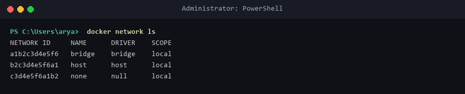
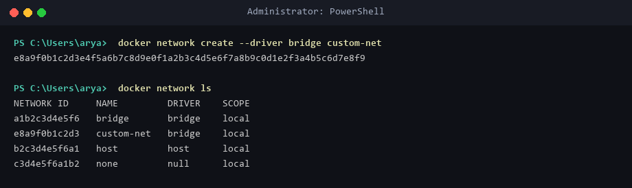
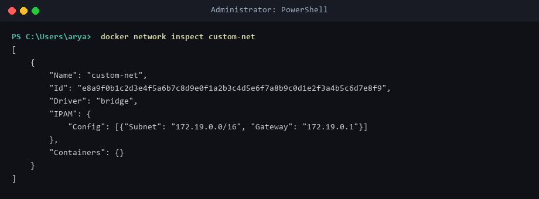
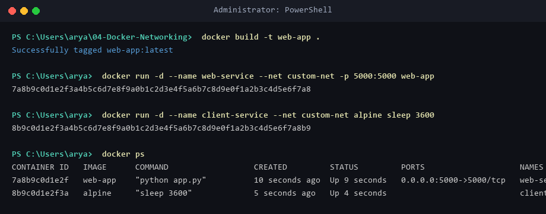
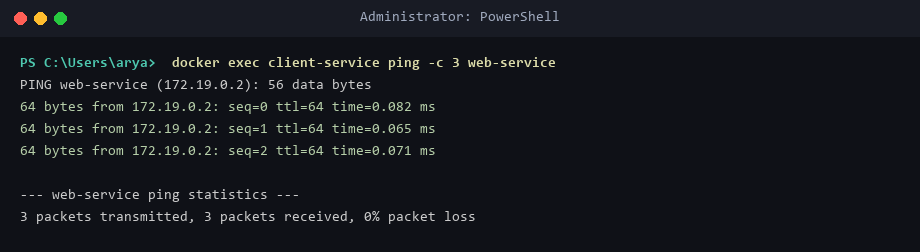
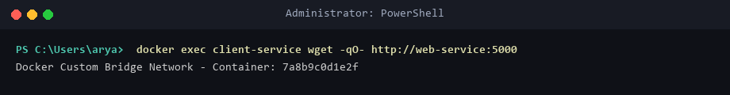
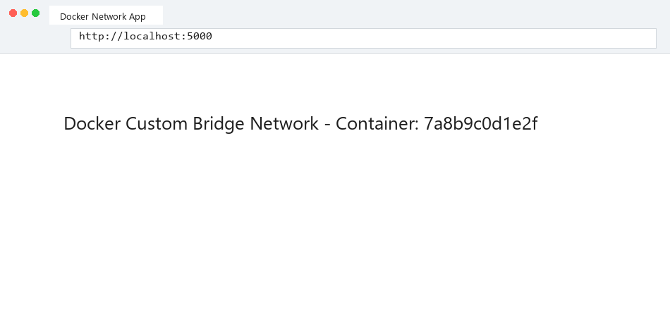

# Lab 04: Docker Networking with Multiple Containers

## Scenario & Objective
In containerized microservice architectures, services must communicate securely across isolated virtual networks. This exercise explores Docker network drivers (`bridge`, `host`, `none`), creating user-defined bridge networks, container name resolution via embedded DNS, and multi-container communication.

---

## Environment Setup & Tools
* **OS:** Windows 11 Home / WSL2 (Ubuntu 24.04 LTS)
* **Container Engine:** Docker Engine `v29.1.3`
* **Network Driver:** Custom User-Defined Bridge (`custom-net`)

---

## Source Files & Manifests

### 1. Flask Web Application (`app.py`)
```python
from flask import Flask
import socket

app = Flask(__name__)

@app.route('/')
def home():
    return f"Docker Custom Bridge Network - Container: {socket.gethostname()}\n"

if __name__ == '__main__':
    app.run(host='0.0.0.0', port=5000)
```

### 2. Dependencies (`requirements.txt`)
```text
flask==3.0.3
```

### 3. Container Image (`Dockerfile`)
```dockerfile
FROM python:3.8-slim
WORKDIR /app
COPY . /app
RUN pip install --no-cache-dir -r requirements.txt
CMD ["python", "app.py"]
```

### 4. Docker Compose Definition (`docker-compose-networking.yaml`)
```yaml
version: '3.8'
services:
  web-service:
    build: .
    container_name: web-service
    networks:
      - custom-net
    ports:
      - "5000:5000"

  client-service:
    image: alpine
    container_name: client-service
    command: sleep 3600
    networks:
      - custom-net

networks:
  custom-net:
    driver: bridge
```

---

## Step-by-Step Execution Guide

### Task 1: List Default Networks
```powershell
docker network ls
```
* **Drivers Available:** `bridge`, `host`, `none`.

### Task 2: Create Custom User-Defined Bridge Network
```powershell
docker network create --driver bridge custom-net
docker network ls
```

### Task 3: Inspect Network Subnet & Gateway
```powershell
docker network inspect custom-net
```
* **IPAM Subnet:** `172.19.0.0/16`, Gateway: `172.19.0.1`.

### Task 4: Launch Web & Client Containers
```powershell
docker build -t web-app .
docker run -d --name web-service --net custom-net -p 5000:5000 web-app
docker run -d --name client-service --net custom-net alpine sleep 3600
docker ps
```

### Task 5: Verify Inter-Container DNS & Connectivity
```powershell
docker exec client-service ping -c 3 web-service
docker exec client-service wget -qO- http://web-service:5000
```
* **Result:** Ping succeeds to IP `172.19.0.2` via container name resolution, and `wget` returns the Flask response.

### Task 6: Verify Host Access
```powershell
curl http://localhost:5000
```
* **Result:** Exposed port `5000:5000` maps host requests directly to `web-service`.

---

## Deployment Evidence

### List Network Drivers


### Create Custom Bridge Network


### Inspect Network Configuration


### Launch Connected Containers


### Container-to-Container DNS Ping


### Inter-Container Wget HTTP Request


### Host Browser Access


---

## Verification Summary
| Container | Network | IP Address | Port Mapping | DNS Resolution Target | Connectivity Status |
|-----------|---------|------------|--------------|-----------------------|---------------------|
| `web-service` | `custom-net` | `172.19.0.2` | `5000:5000` | `web-service` | `200 OK` |
| `client-service` | `custom-net` | `172.19.0.3` | N/A | `client-service` | `Ping 0% Loss` |

---

## Exercise Questions & Answers

**Q1: What is the purpose of the `--net` flag in `docker run`?**  
**A1:** The `--net` (or `--network`) flag connects the launching container to a specific Docker network (e.g. `custom-net`), enabling IP assignment and DNS resolution on that network.

**Q2: How do containers communicate with each other on the same custom network?**  
**A2:** On custom user-defined networks, Docker provides an automatic embedded DNS server that resolves container names (`web-service`) directly to container IP addresses (`172.19.0.2`).

**Q3: What is the difference between a `bridge` network and a `host` network?**  
**A3:** 
* **Bridge Network:** Containers run in isolated software bridges with private IP addresses, communicating via mapped ports or virtual switches.
* **Host Network:** Containers bypass network isolation and share the host machine's network stack and interfaces directly.

**Q4: How can you expose a container's port to the host machine?**  
**A4:** By using the `-p` (or `--publish`) flag during `docker run`, such as `-p 5000:5000` (HostPort:ContainerPort).
