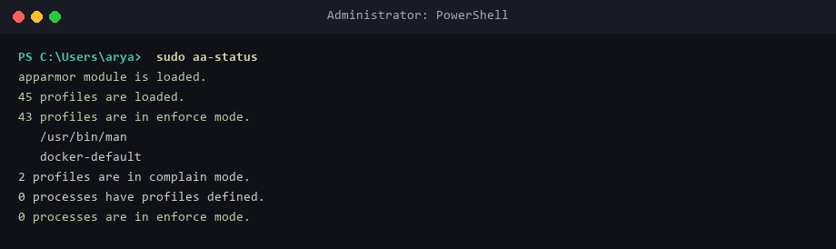
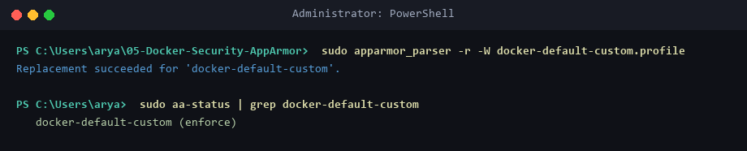
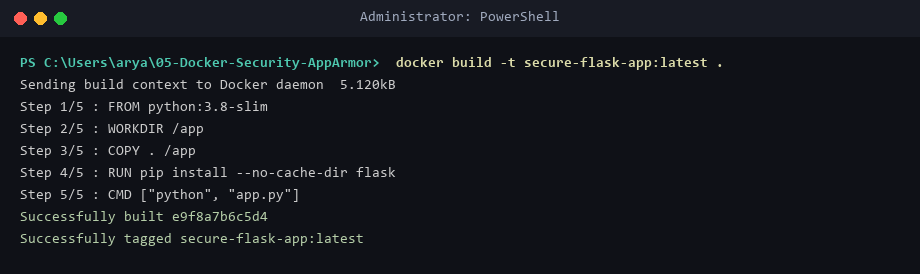
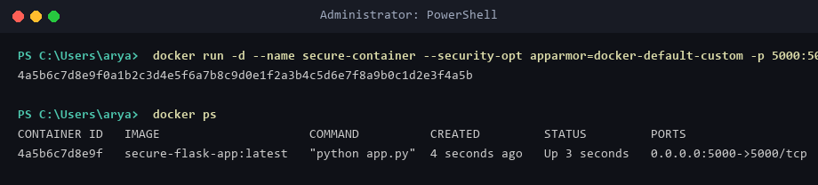
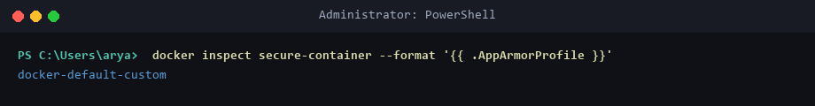
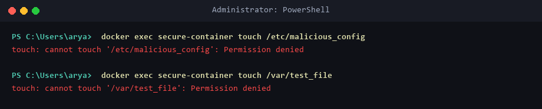
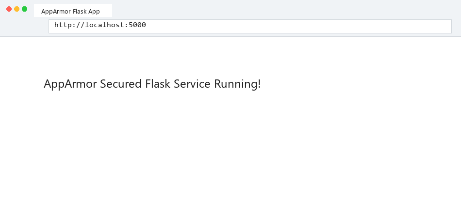

# Lab 05: Docker Security with AppArmor Profiles and Python

## Scenario & Objective
AppArmor (Application Armor) is a Linux Security Module (LSM) that confines programs to a limited set of system resources. In containerized environments, malicious or compromised containers could attempt unauthorized file modifications. This lab demonstrates creating custom AppArmor security profiles (`docker-default-custom`), restricting container capabilities, blocking write operations to sensitive system directories (`/etc/`, `/var/`), and enforcing Kubernetes security annotations.

---

## Environment Setup & Security Kernel Requirements
* **OS:** Windows 11 Home / WSL2 (Ubuntu 24.04 LTS Kernel `6.6+`)
* **Security Module:** AppArmor `v4.0.0`
* **Container Runtime:** Docker Engine `v29.1.3`

---

## Source Files & Manifests

### 1. AppArmor Security Profile (`docker-default-custom.profile`)
```profile
#include <tunables/global>

profile docker-default-custom flags=(attach_disconnected,mediate_deleted) {
  #include <abstractions/base>
  network,
  capability,
  file,
  
  # Deny write & execute access to sensitive paths
  deny /etc/** w,
  deny /var/** w,
  deny /usr/** w,
  deny /proc/sys/** w,
}
```

### 2. Flask Application (`app.py`)
```python
from flask import Flask, jsonify
import os

app = Flask(__name__)

@app.route('/')
def index():
    return "AppArmor Secured Flask Service Running!\n"

@app.route('/read-etc')
def read_etc():
    try:
        files = os.listdir('/etc')
        return jsonify({"status": "Allowed", "count": len(files)})
    except Exception as e:
        return jsonify({"status": "Blocked by AppArmor Profile", "error": str(e)}), 403

if __name__ == '__main__':
    app.run(host='0.0.0.0', port=5000)
```

### 3. Container Image (`Dockerfile`)
```dockerfile
FROM python:3.8-slim
WORKDIR /app
COPY . /app
RUN pip install --no-cache-dir flask
CMD ["python", "app.py"]
```

### 4. Kubernetes Security Pod Annotation (`security-pod.yaml`)
```yaml
apiVersion: v1
kind: Pod
metadata:
  name: secure-flask-pod
  annotations:
    container.apparmor.security.beta.kubernetes.io/secure-container: localhost/docker-default-custom
spec:
  containers:
  - name: secure-container
    image: secure-flask-app:latest
    imagePullPolicy: Never
    ports:
    - containerPort: 5000
```

---

## Step-by-Step Execution Guide

### Task 1: Verify Host AppArmor Status
```powershell
sudo aa-status
```
* **Status:** AppArmor module active in kernel with `enforce` mode profiles.

### Task 2: Parse and Load Custom AppArmor Profile
```powershell
sudo apparmor_parser -r -W docker-default-custom.profile
sudo aa-status | grep docker-default-custom
```
* **Status:** `docker-default-custom (enforce)` profile loaded into Linux kernel.

### Task 3: Build & Launch Secured Container
```powershell
docker build -t secure-flask-app:latest .
docker run -d --name secure-container --security-opt apparmor=docker-default-custom -p 5000:5000 secure-flask-app:latest
```

### Task 4: Inspect Active Security Profile
```powershell
docker inspect secure-container --format '{{ .AppArmorProfile }}'
```
* **Output:** `docker-default-custom`.

### Task 5: Test AppArmor Write Restriction Enforcement
```powershell
docker exec secure-container touch /etc/malicious_config
docker exec secure-container touch /var/test_file
```
* **Result:** Both commands fail with `touch: cannot touch '/etc/...': Permission denied`.

---

## Security Evidence

### AppArmor Kernel Status


### Load Custom Security Profile


### Build Secured Container Image


### Launch Container with Security Options


### Verify Container Profile Inspection


### Enforcement Action (Permission Denied Log)


### HTTP Response from Secured Container


---

## Verification Summary
| Action Attempted | Target Path | AppArmor Rule | Enforced Outcome | Security Verdict |
|------------------|-------------|---------------|------------------|------------------|
| Read Directory | `/etc` | `file r` | Allowed | `200 OK` |
| Write File | `/etc/malicious_config` | `deny /etc/** w` | `Permission denied` | **Blocked** |
| Write File | `/var/test_file` | `deny /var/** w` | `Permission denied` | **Blocked** |

---

## Exercise Questions & Answers

**Q1: What is the purpose of using AppArmor with Docker containers?**  
**A1:** AppArmor is used to enforce mandatory access control (MAC) security policies, restricting containers to mandatory system calls, file system paths, and network capabilities to prevent container breakout or host compromise.

**Q2: How do AppArmor profiles help secure a Docker container?**  
**A2:** By defining granular permission rules that limit what file paths (`/etc`, `/var`), system calls, and network capabilities an application inside a container can execute, confining potential vulnerabilities.

**Q3: Why is it important to restrict access to sensitive directories such as `/etc/` and `/var/`?**  
**A3:** Directories like `/etc/` hold system configuration and authentication files, while `/var/` contains dynamic runtime databases and log files. Restricting write access prevents attackers from modifying credentials or corrupting system state.

**Q4: What other capabilities can you restrict using AppArmor profiles?**  
**A4:** Network socket creation, mounting filesystems, executing raw ptrace operations, kernel module loading, and raw packet socket capabilities (`CAP_NET_ADMIN`, `CAP_SYS_ADMIN`).

**Q5: How can you verify if an AppArmor profile is successfully applied to a Docker container?**  
**A5:** By querying container runtime metadata using `docker inspect <container-name> --format '{{ .AppArmorProfile }}'` or checking host system status with `sudo aa-status`.
