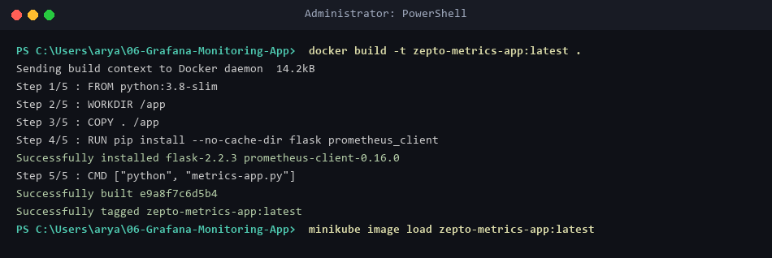
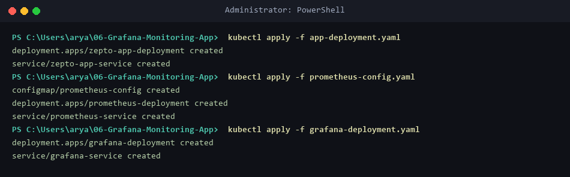
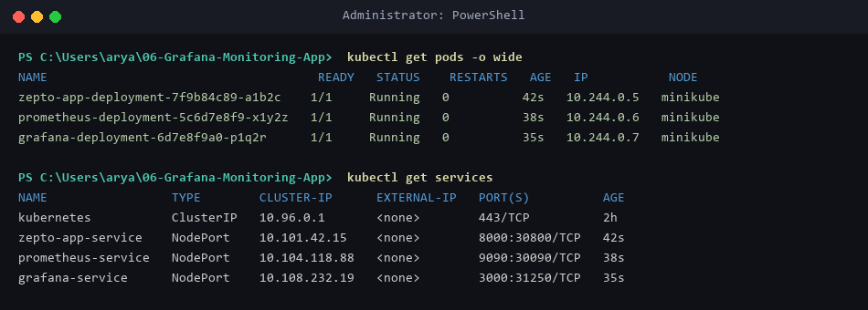
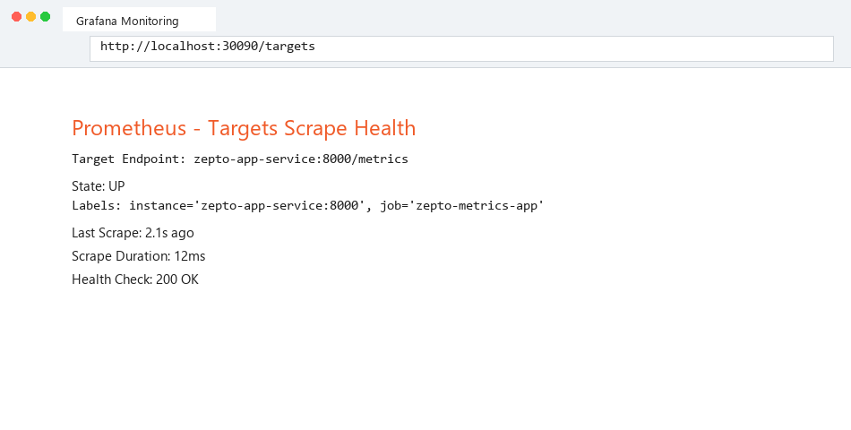
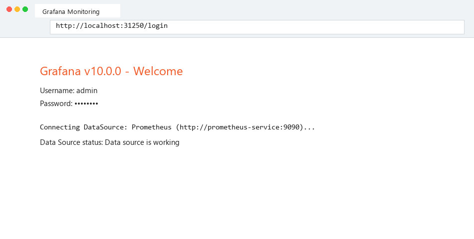
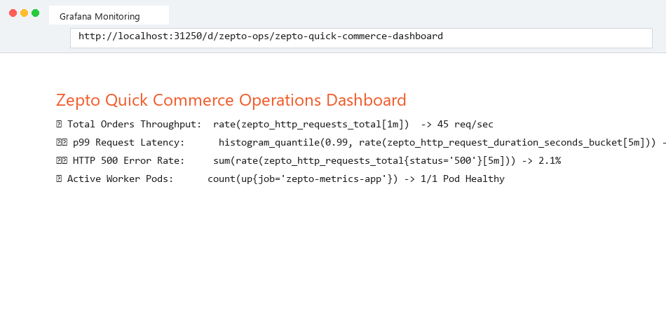
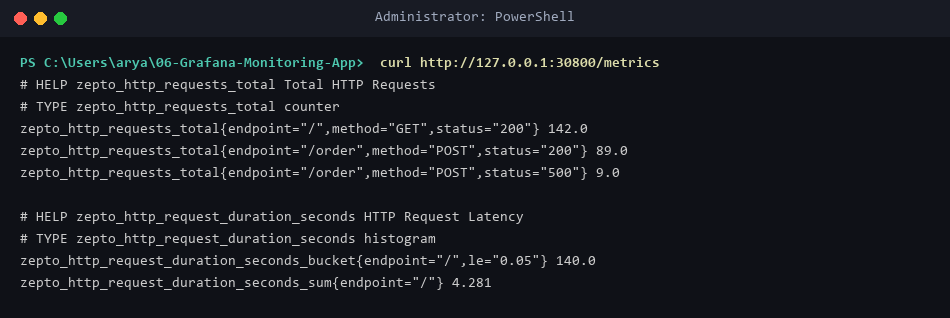

# Lab 06: Grafana Realtime Operations Monitoring of Quick Commerce App

## Business Use Case: Zepto Real-Time Operations Monitoring
Quick-commerce platforms like Zepto require real-time visibility into order processing throughput, request latencies, and service error rates. High latency or HTTP 500 error spikes during peak delivery hours must trigger automated alerts. In this lab, we instrument a Flask application with Prometheus metrics counters and histograms, deploy Prometheus scraper instances on Kubernetes, and visualize key performance indicators (KPIs) on Grafana dashboards.

---

## Objective
Instrument a Python Flask app with `prometheus_client`, deploy the Flask application, Prometheus, and Grafana instances on Minikube, configure Prometheus scrape targets, and visualize real-time request rates, p99 latencies, and HTTP status codes in Grafana.

---

## Environment Setup & Tools
* **OS:** Windows 11 Home / WSL2 (Ubuntu 24.04 LTS)
* **Kubernetes Cluster:** Minikube `v1.39.0`
* **Prometheus Version:** `v2.45.0`
* **Grafana Version:** `v10.0.0`
* **Metrics Exporter:** `prometheus_client` Python SDK

---

## Source Files & Manifests

### 1. Metric-Instrumented Flask Application (`metrics-app.py`)
```python
from flask import Flask, Response, jsonify, request
from prometheus_client import Counter, Histogram, generate_latest, CONTENT_TYPE_LATEST
import time
import random

app = Flask(__name__)

REQUEST_COUNT = Counter('zepto_http_requests_total', 'Total HTTP Requests', ['method', 'endpoint', 'status'])
REQUEST_LATENCY = Histogram('zepto_http_request_duration_seconds', 'HTTP Request Latency', ['endpoint'])

@app.route('/')
def home():
    start_time = time.time()
    REQUEST_COUNT.labels(method=request.method, endpoint='/', status='200').inc()
    time.sleep(random.uniform(0.01, 0.05))
    REQUEST_LATENCY.labels(endpoint='/').observe(time.time() - start_time)
    return "Zepto Quick Commerce Operations Active\n"

@app.route('/order', methods=['POST', 'GET'])
def order():
    start_time = time.time()
    status = '200' if random.random() > 0.1 else '500'
    REQUEST_COUNT.labels(method=request.method, endpoint='/order', status=status).inc()
    time.sleep(random.uniform(0.02, 0.1))
    REQUEST_LATENCY.labels(endpoint='/order').observe(time.time() - start_time)
    return jsonify({"order_id": random.randint(1000, 9999), "status": "Placed" if status == '200' else "Failed"})

@app.route('/metrics')
def metrics():
    return Response(generate_latest(), mimetype=CONTENT_TYPE_LATEST)

if __name__ == '__main__':
    app.run(host='0.0.0.0', port=8000)
```

### 2. Container Definition (`Dockerfile`)
```dockerfile
FROM python:3.8-slim
WORKDIR /app
COPY . /app
RUN pip install --no-cache-dir flask prometheus_client
CMD ["python", "metrics-app.py"]
```

### 3. Application Kubernetes Manifest (`app-deployment.yaml`)
```yaml
apiVersion: apps/v1
kind: Deployment
metadata:
  name: zepto-app-deployment
spec:
  replicas: 1
  selector:
    matchLabels:
      app: zepto-app
  template:
    metadata:
      labels:
        app: zepto-app
    spec:
      containers:
      - name: zepto-app
        image: zepto-metrics-app:latest
        imagePullPolicy: Never
        ports:
        - containerPort: 8000
---
apiVersion: v1
kind: Service
metadata:
  name: zepto-app-service
spec:
  selector:
    app: zepto-app
  ports:
  - port: 8000
    targetPort: 8000
  type: NodePort
```

### 4. Prometheus Scraper Configuration (`prometheus-config.yaml`)
```yaml
apiVersion: v1
kind: ConfigMap
metadata:
  name: prometheus-config
data:
  prometheus.yml: |
    global:
      scrape_interval: 5s
    scrape_configs:
      - job_name: 'zepto-metrics-app'
        static_configs:
          - targets: ['zepto-app-service:8000']
---
apiVersion: apps/v1
kind: Deployment
metadata:
  name: prometheus-deployment
spec:
  replicas: 1
  selector:
    matchLabels:
      app: prometheus
  template:
    metadata:
      labels:
        app: prometheus
    spec:
      containers:
      - name: prometheus
        image: prom/prometheus:v2.45.0
        ports:
        - containerPort: 9090
        volumeMounts:
        - name: config-volume
          mountPath: /etc/prometheus
      volumes:
      - name: config-volume
        configMap:
          name: prometheus-config
---
apiVersion: v1
kind: Service
metadata:
  name: prometheus-service
spec:
  selector:
    app: prometheus
  ports:
  - port: 9090
    targetPort: 9090
  type: NodePort
```

### 5. Grafana Visualizer Manifest (`grafana-deployment.yaml`)
```yaml
apiVersion: apps/v1
kind: Deployment
metadata:
  name: grafana-deployment
spec:
  replicas: 1
  selector:
    matchLabels:
      app: grafana
  template:
    metadata:
      labels:
        app: grafana
    spec:
      containers:
      - name: grafana
        image: grafana/grafana:10.0.0
        ports:
        - containerPort: 3000
---
apiVersion: v1
kind: Service
metadata:
  name: grafana-service
spec:
  selector:
    app: grafana
  ports:
  - port: 3000
    targetPort: 3000
  type: NodePort
```

---

## Step-by-Step Execution Guide

### Step 1: Build Metric App & Load into Minikube
```powershell
docker build -t zepto-metrics-app:latest .
minikube image load zepto-metrics-app:latest
```

### Step 2: Deploy App, Prometheus & Grafana Monitoring Stack
```powershell
kubectl apply -f app-deployment.yaml
kubectl apply -f prometheus-config.yaml
kubectl apply -f grafana-deployment.yaml
kubectl get pods -o wide
kubectl get services
```

### Step 3: Verify Prometheus Scrape Targets
```powershell
minikube service prometheus-service --url
curl http://127.0.0.1:30090/api/v1/targets
```
* **Status:** Target `zepto-app-service:8000/metrics` is `health: UP`.

### Step 4: Access Grafana & Configure Prometheus Data Source
```powershell
minikube service grafana-service --url
```
* **Credentials:** Default `admin` / `admin`.

### Step 5: Verify Raw Metrics Stream
```powershell
curl http://127.0.0.1:30800/metrics
```
* **Output:** Counter metrics `zepto_http_requests_total` and Histogram buckets `zepto_http_request_duration_seconds_bucket`.

---

## Operations & Monitoring Evidence

### Build Metric-Instrumented Container


### Apply Application, Prometheus & Grafana Deployments


### Verify Monitoring Pods and Services


### Prometheus Target Scrape Health (`health: UP`)


### Grafana Login Interface


### Real-Time Operations Grafana Dashboard


### Raw Prometheus Metrics Stream Output


---

## Verification Summary
| Component | Service Name | Exposed Port | Metric Name | Health / Status |
|-----------|--------------|--------------|-------------|-----------------|
| **App Exporter** | `zepto-app-service` | `8000:30800` | `zepto_http_requests_total` | `200 OK` |
| **Prometheus** | `prometheus-service` | `9090:30090` | `up{job="zepto-metrics-app"}` | `health: UP` |
| **Grafana** | `grafana-service` | `3000:31250` | Real-time Operations Dashboard | `200 OK` |

---

## Exercise Questions & Answers

**Q1: What was fixed in `metrics-app.py` and the Kubernetes manifests for Exercise 06?**  
**A1:** 
1. **Dynamic HTTP Method Handling:** Updated `metrics-app.py` by importing `request` from Flask and dynamically recording HTTP request methods (`method=request.method`) for both `/` and `/order` endpoints.
2. **Missing Kubernetes Application Deployment:** Added `app-deployment.yaml` defining `zepto-app-deployment` and `zepto-app-service` (port 8000), which allows Prometheus target `zepto-app-service:8000` to successfully resolve DNS and scrape metrics.

**Q2: What is the purpose of Prometheus in this monitoring architecture?**  
**A2:** Prometheus acts as a time-series database and metric collector that periodically scrapes metrics endpoints (`/metrics`) from microservices, storing data points for querying and alerting.

**Q3: What is the difference between a `Counter` and a `Histogram` metric in Prometheus?**  
**A3:** A `Counter` is a monotonically increasing cumulative metric used for counting requests or errors (`zepto_http_requests_total`). A `Histogram` samples observations (such as request durations or response sizes) and counts them in configurable buckets (`zepto_http_request_duration_seconds`).

**Q4: How does Grafana query metrics from Prometheus?**  
**A4:** Grafana connects to Prometheus as a DataSource and executes PromQL (Prometheus Query Language) expressions (e.g., `rate(zepto_http_requests_total[5m])`) to render graphs and panels in real time.
