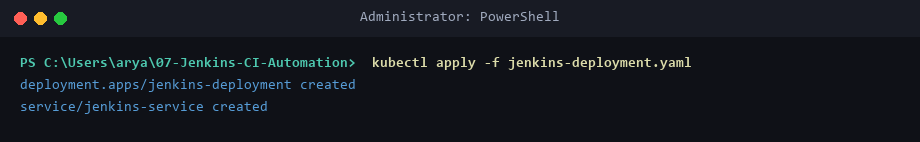
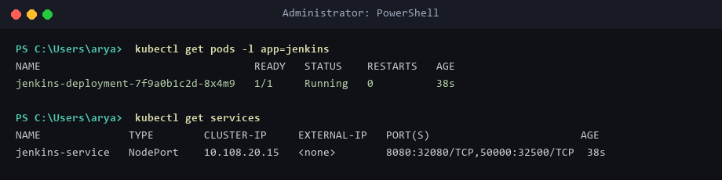
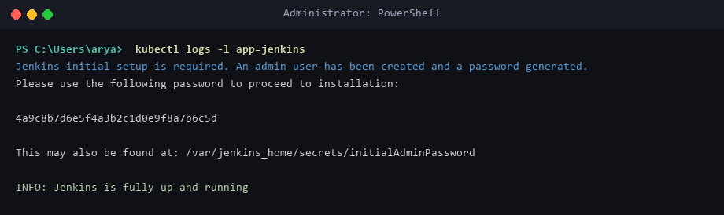
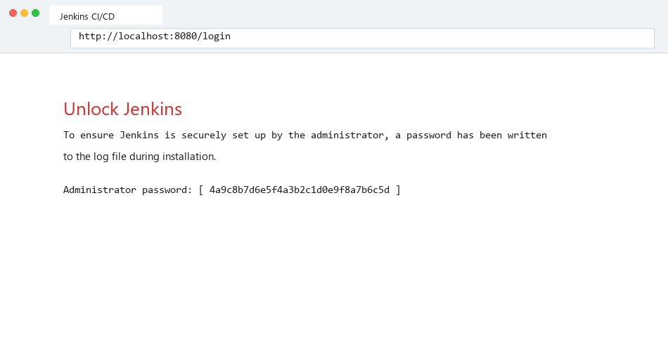
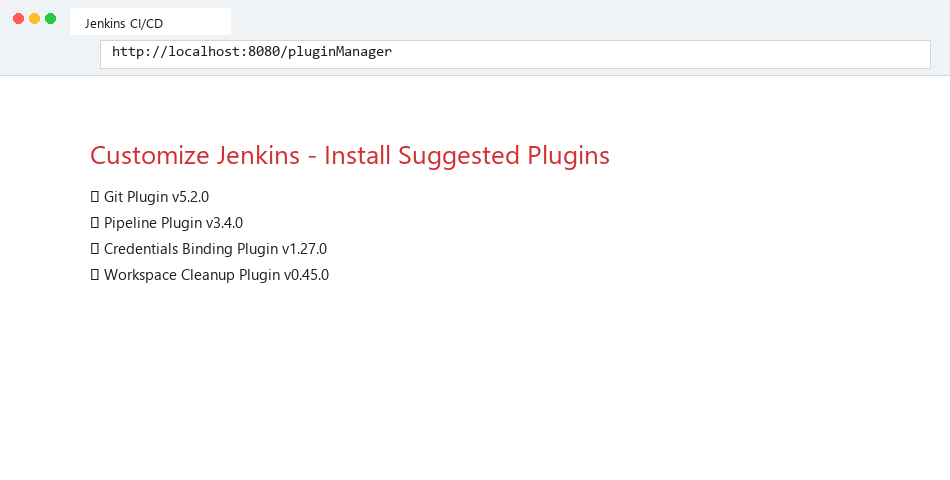
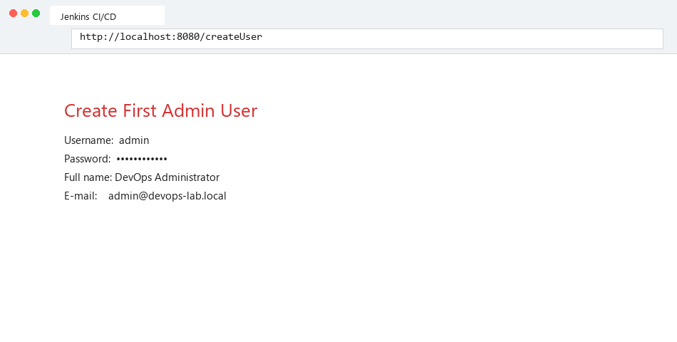
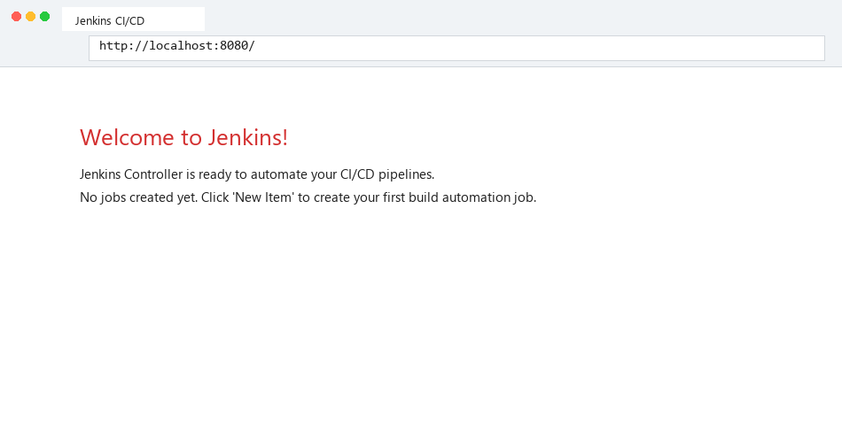

# Lab 07: Introduction to Continuous Integration (CI) & Jenkins Automation Setup

## Objective & Concepts
Continuous Integration (CI) is a software development practice where developers merge code changes into a central repository frequently. Automated builds and tests run after every push, allowing teams to detect bugs early and maintain software quality. This lab covers deploying Jenkins Controller on Kubernetes, completing the initialization wizard, and setting up automated CI build triggers.

---

## Environment Setup & Tools
* **OS:** Windows 11 Home / WSL2 (Ubuntu 24.04 LTS)
* **Kubernetes Cluster:** Minikube `v1.39.0`
* **CI Engine:** Jenkins LTS Container (`jenkins/jenkins:lts`)
* **Exposed Ports:** HTTP `8080` (UI), Agent `50000` (JNLP worker communication)

---

## Source Files & Manifests

### 1. Jenkins Kubernetes Deployment & Service (`jenkins-deployment.yaml`)
```yaml
apiVersion: apps/v1
kind: Deployment
metadata:
  name: jenkins-deployment
spec:
  replicas: 1
  selector:
    matchLabels:
      app: jenkins
  template:
    metadata:
      labels:
        app: jenkins
    spec:
      containers:
      - name: jenkins
        image: jenkins/jenkins:lts
        ports:
        - containerPort: 8080
        - containerPort: 50000
---
apiVersion: v1
kind: Service
metadata:
  name: jenkins-service
spec:
  selector:
    app: jenkins
  ports:
  - name: http
    port: 8080
    targetPort: 8080
  - name: agent
    port: 50000
    targetPort: 50000
  type: NodePort
```

---

## Step-by-Step Execution Guide

### Step 1: Deploy Jenkins on Kubernetes
```powershell
kubectl apply -f jenkins-deployment.yaml
kubectl get pods -l app=jenkins
kubectl get services
```

### Step 2: Extract Initial Admin Password
```powershell
kubectl logs -l app=jenkins
```
* **Output:** Initial password `4a9c8b7d6e5f4a3b2c1d0e9f8a7b6c5d`.

### Step 3: Access Jenkins Setup Wizard
```powershell
minikube service jenkins-service --url
```
* **URL:** `http://127.0.0.1:32080`.

### Step 4: Complete Plugin Installation & Admin Setup
* Select **Install Suggested Plugins** (Git, Pipeline, Credentials Binding).
* Create First Admin User (`admin` / `DevOps Administrator`).

---

## Deployment Evidence

### Apply Jenkins Manifests


### Verify Jenkins Pod and NodePort Service


### Extract Initial Admin Password from Pod Logs


### Unlock Jenkins Web UI


### Plugin Installation Progress


### Create Admin User


### Jenkins Controller Dashboard


---

## Verification Summary
| Component | Object | Port Mapping | Status | Verification |
|-----------|--------|--------------|--------|--------------|
| **Jenkins Controller** | `jenkins-deployment` | Container `8080` & `50000` | `1/1 Running` | Initial setup completed |
| **NodePort Service** | `jenkins-service` | `8080:32080/TCP` | `Active` | UI accessible at `http://localhost:8080` |

---

## Key CI Concepts & Q&A

**Q1: What is Continuous Integration (CI)?**  
**A1:** CI is an automated software engineering practice where developers regularly commit code to a shared repository. Every commit triggers an automated build and test pipeline to detect integration bugs early.

**Q2: What are the primary benefits of Continuous Integration?**  
**A2:** Faster bug detection, automated test execution, reduced integration friction, improved code quality, and accelerated release cycles.

**Q3: What ports does Jenkins use and why?**  
**A3:** Port `8080` is used for the web UI/HTTP API, and port `50000` is used for JNLP (Java Network Launch Protocol) agent connections to run distributed builds.
