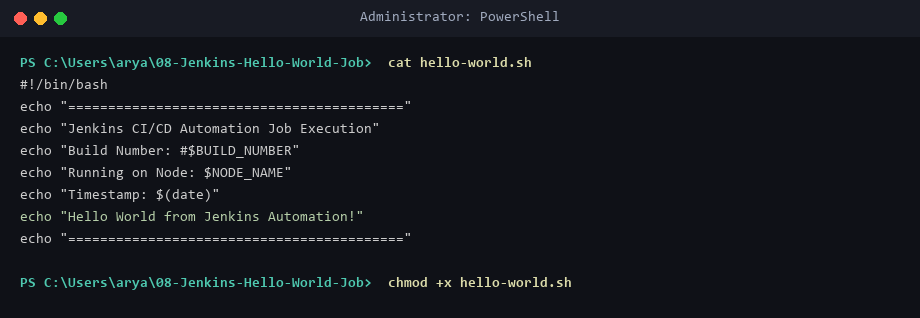
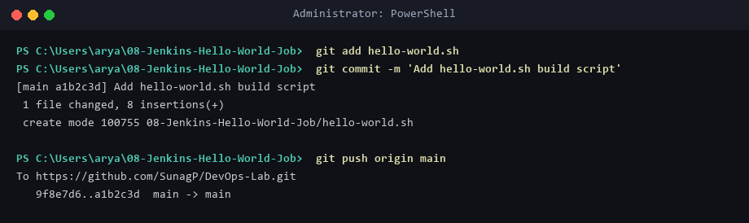
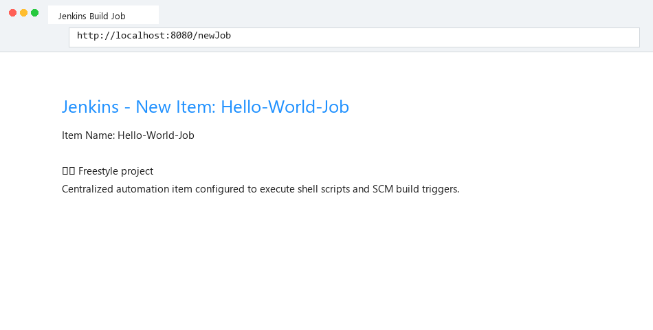
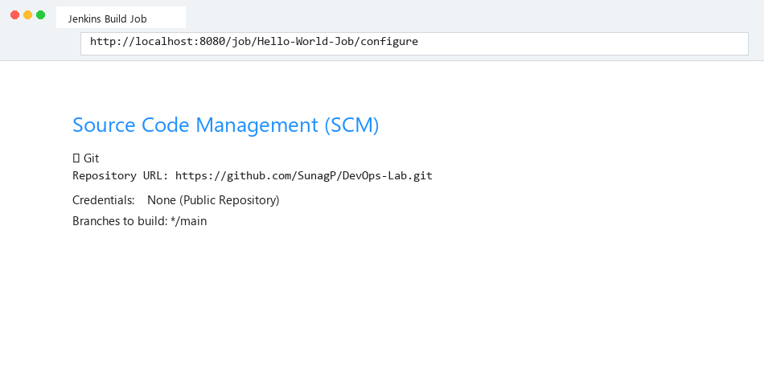
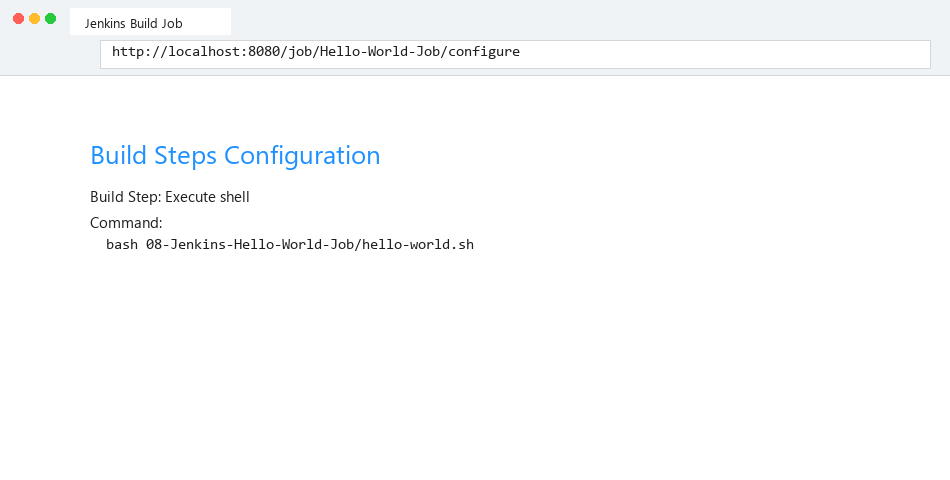
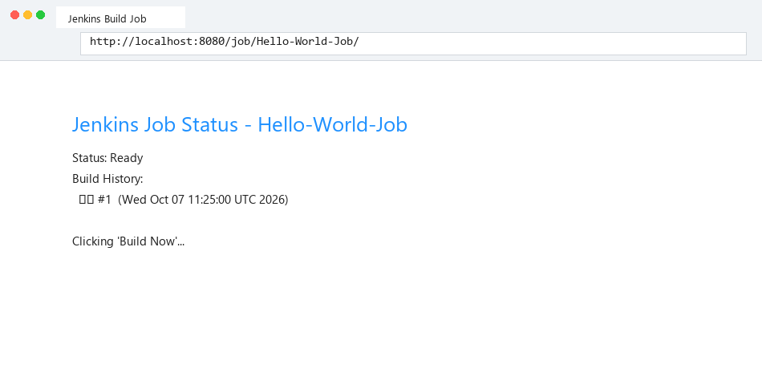
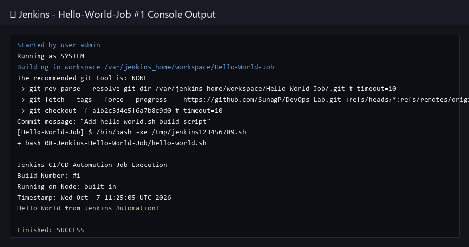

# Lab 08: Creating a "Hello World" Jenkins Freestyle Job

## Objective & Overview
Freestyle build projects are the fundamental automation building blocks in Jenkins. In this lab, we write an executable shell script (`hello-world.sh`), push it to a Git repository, create a Jenkins Freestyle project, configure Git SCM integration and Shell build steps, and verify automated execution through Console Output logs.

---

## Environment Setup & Tools
* **OS:** Windows 11 Home / WSL2 (Ubuntu 24.04 LTS)
* **CI Controller:** Jenkins LTS (`v2.440.1`)
* **SCM:** Git / GitHub Repository (`SunagP/DevOps-Lab`)
* **Job Type:** Freestyle Project (`Hello-World-Job`)

---

## Source Files & Job Configuration

### 1. Build Execution Script (`hello-world.sh`)
```bash
#!/bin/bash
echo "=========================================="
echo "Jenkins CI/CD Automation Job Execution"
echo "Build Number: #$BUILD_NUMBER"
echo "Running on Node: $NODE_NAME"
echo "Timestamp: $(date)"
echo "Hello World from Jenkins Automation!"
echo "=========================================="
```

### 2. Freestyle Job Template (`freestyle-job.xml`)
```xml
<?xml version='1.1' encoding='UTF-8'?>
<project>
  <actions/>
  <description>Freestyle Hello World Build Job for DevOps Lab</description>
  <keepDependencies>false</keepDependencies>
  <properties/>
  <scm class="hudson.plugins.git.GitSCM" plugin="git@5.2.0">
    <configVersion>2</configVersion>
    <userRemoteConfigs>
      <hudson.plugins.git.UserRemoteConfig>
        <url>https://github.com/SunagP/DevOps-Lab.git</url>
      </hudson.plugins.git.UserRemoteConfig>
    </userRemoteConfigs>
    <branches>
      <hudson.plugins.git.BranchSpec>
        <name>*/main</name>
      </hudson.plugins.git.BranchSpec>
    </branches>
  </scm>
  <builders>
    <hudson.tasks.Shell>
      <command>bash 08-Jenkins-Hello-World-Job/hello-world.sh</command>
    </hudson.tasks.Shell>
  </builders>
  <publishers/>
  <buildWrappers/>
</project>
```

---

## Step-by-Step Execution Guide

### Step 1: Create Executable Script & Commit to SCM
```powershell
chmod +x hello-world.sh
git add hello-world.sh
git commit -m "Add hello-world.sh build script"
git push origin main
```

### Step 2: Create New Item in Jenkins UI
* Navigate to `http://localhost:8080/newJob`.
* Enter Item Name: `Hello-World-Job`.
* Select **Freestyle project** and click **OK**.

### Step 3: Configure Git SCM & Build Step
* Under **Source Code Management**, select **Git**.
* Repository URL: `https://github.com/SunagP/DevOps-Lab.git`.
* Branch Specifier: `*/main`.
* Under **Build Steps**, select **Add build step** -> **Execute shell**.
* Command: `bash 08-Jenkins-Hello-World-Job/hello-world.sh`.

### Step 4: Trigger Build & Inspect Console Output
* Click **Build Now** on the job page.
* Open **Build #1** -> **Console Output**.

---

## Execution Evidence

### Local Build Script Creation


### SCM Commit and Push to GitHub


### Create Freestyle Job in Jenkins UI


### Configure Git SCM Repository URL


### Configure Shell Build Step


### Trigger Build Now Action


### Console Output Logs (`Finished: SUCCESS`)


---

## Verification Summary
| Job Name | SCM Trigger | Target Script | Build Status | Console Result |
|----------|-------------|---------------|--------------|----------------|
| `Hello-World-Job` | Git `*/main` | `hello-world.sh` | `#1 SUCCESS` | `"Hello World from Jenkins Automation!"` |

---

## Exercise Questions & Answers

**Q1: What is a Jenkins Freestyle project?**  
**A1:** A Freestyle project is a traditional, UI-driven build job in Jenkins that allows users to configure SCM checkout, build steps (shell/batch scripts), triggers, and post-build actions via web forms.

**Q2: How does Jenkins inject environment variables like `$BUILD_NUMBER` into scripts?**  
**A2:** Jenkins automatically exports job metadata environment variables (`BUILD_NUMBER`, `JOB_NAME`, `NODE_NAME`, `WORKSPACE`) into the shell environment before executing build steps.

**Q3: What is the purpose of SCM integration in Jenkins build jobs?**  
**A3:** SCM integration allows Jenkins to automatically clone/checkout the latest source code from a repository (e.g. GitHub) before running build and test scripts.
