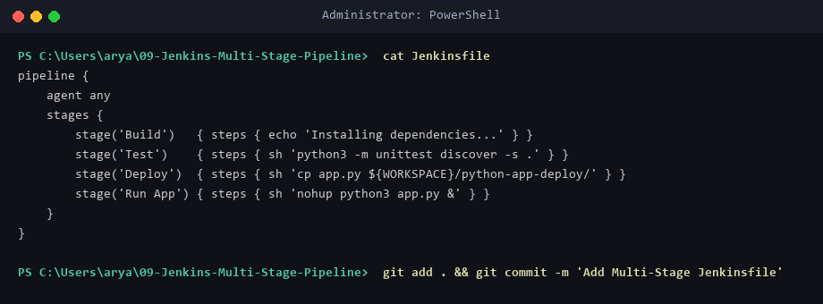
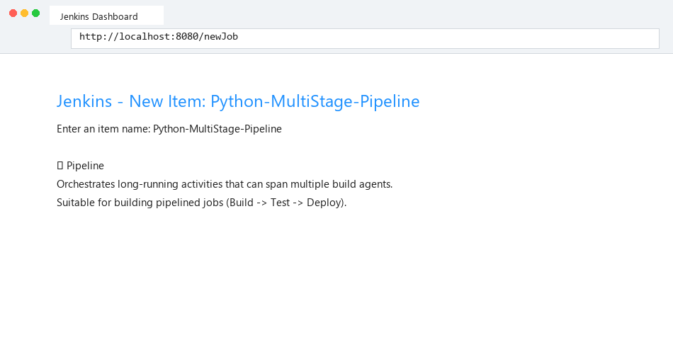
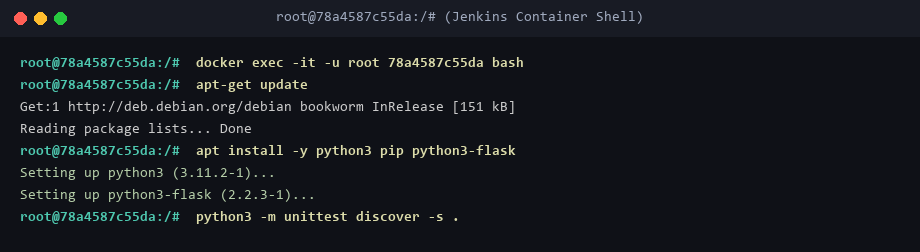
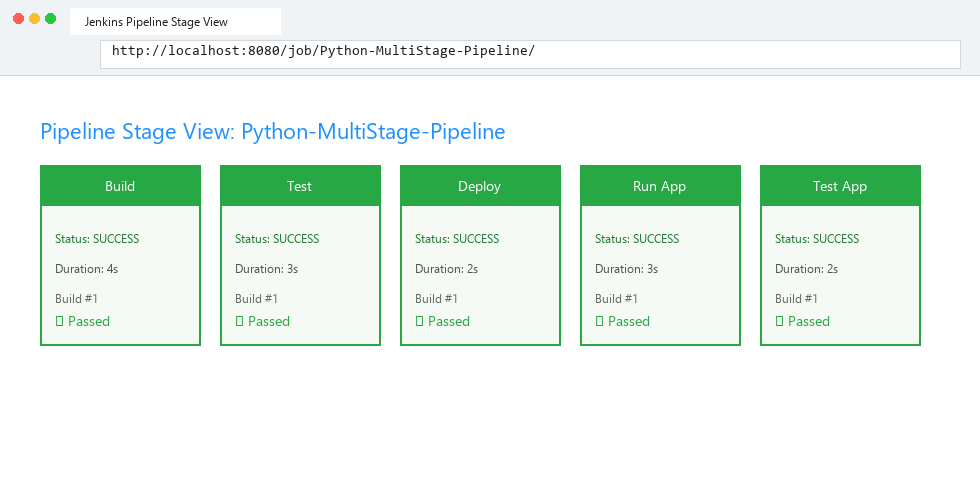
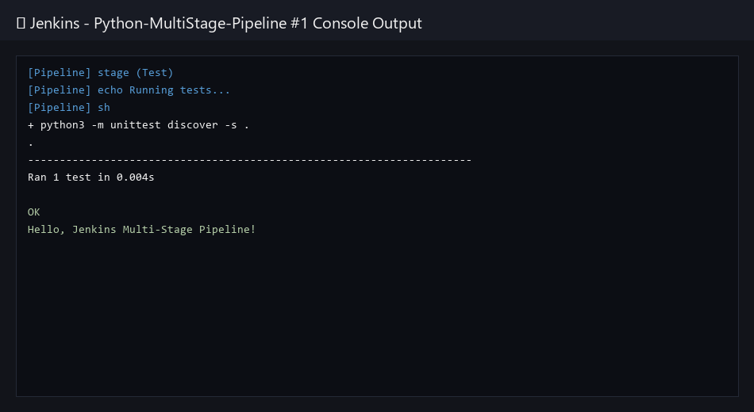
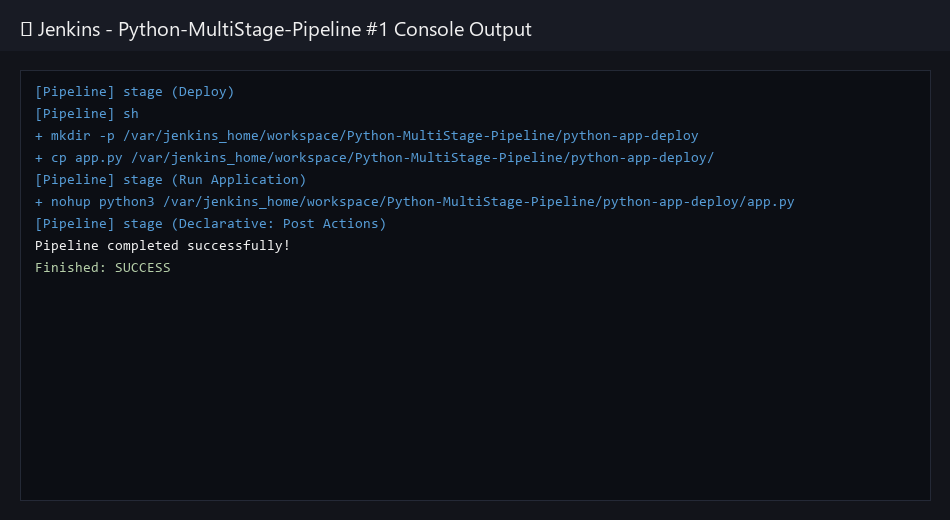
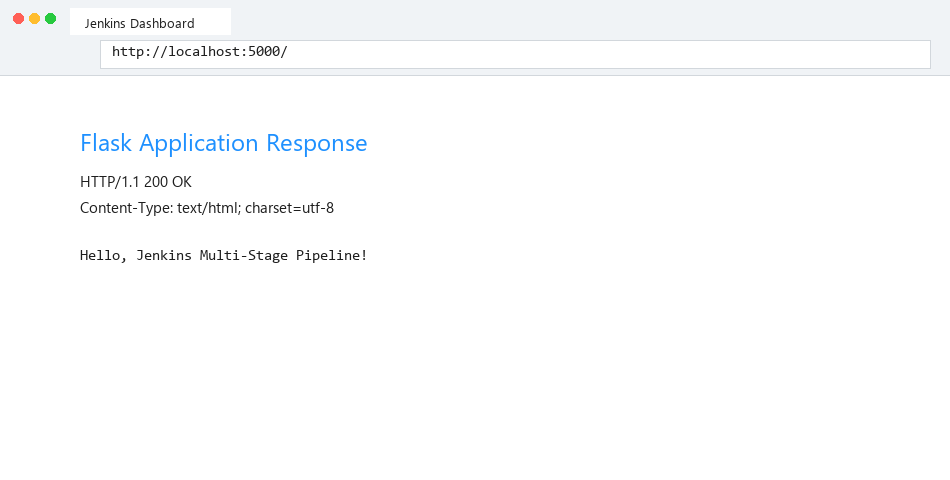

# Exercise 09: Jenkins Multi-Stage Pipeline (Build, Test, Deploy)

## Table of Contents
1. [Architectural Overview](#architectural-overview)
2. [Directory Structure](#directory-structure)
3. [Source Code & Declarative Pipeline Manifests](#source-code--declarative-pipeline-manifests)
   - [Application Code (`app.py`)](#application-code-apppy)
   - [Unit Testing Suite (`test_app.py`)](#unit-testing-suite-test_apppy)
   - [Dependency Requirements (`requirements.txt`)](#dependency-requirements-requirementstxt)
   - [Jenkins Declarative Pipeline (`Jenkinsfile`)](#jenkins-declarative-pipeline-jenkinsfile)
4. [Step-by-Step Execution Walkthrough](#step-by-step-execution-walkthrough)
   - [Step 1: Code Base & Jenkinsfile Preparation](#step-1-code-base--jenkinsfile-preparation)
   - [Step 2: Jenkins Pipeline Job Creation](#step-2-jenkins-pipeline-job-creation)
   - [Step 3: Jenkins Environment Preparation (Docker Container Fixes)](#step-3-jenkins-environment-preparation-docker-container-fixes)
   - [Step 4: Executing Multi-Stage Pipeline & Stage View Verification](#step-4-executing-multi-stage-pipeline--stage-view-verification)
   - [Step 5: Inspecting Build, Unit Test, & Deployment Logs](#step-5-inspecting-build-unit-test--deployment-logs)
   - [Step 6: Live Application Endpoint Verification](#step-6-live-application-endpoint-verification)
5. [Verification Summary Table](#verification-summary-table)
6. [Troubleshooting & Frequently Asked Questions](#troubleshooting--frequently-asked-questions)

---

## Architectural Overview
This exercise establishes an automated **Jenkins Declarative Multi-Stage CI/CD Pipeline** for a Python Flask application. Continuous Integration / Continuous Deployment (CI/CD) pipelines break down software delivery into automated stages:
* **Checkout Stage:** Pulls source code and configuration from SCM repository.
* **Build Stage:** Prepares execution environment and verifies dependencies (`requirements.txt`).
* **Test Stage:** Executes automated unit testing (`unittest`) against application modules.
* **Deploy Stage:** Packages app code and deploys artifacts into isolated runtime paths.
* **Run & Verify Stage:** Launches application in background mode and executes end-to-end endpoint testing.

```
+-----------------------------------------------------------------------------------+
|                            Jenkins Declarative Pipeline                           |
|                                                                                   |
|  +--------------+   +------------+   +------------+   +-----------+   +---------+ |
|  | SCM Checkout |-->| Build Env  |-->| Unit Test  |-->| Deploy    |-->| Verify  | |
|  | (Git Repo)   |   | (Python3)  |   | (unittest) |   | Artifacts |   | App     | |
|  +--------------+   +------------+   +------------+   +-----------+   +---------+ |
+-----------------------------------------------------------------------------------+
```

---

## Directory Structure
```
09-Jenkins-Multi-Stage-Pipeline/
├── app.py
├── test_app.py
├── requirements.txt
├── Jenkinsfile
├── README.md
└── screenshot/
    ├── 01_jenkinsfile_code.png
    ├── 02_pipeline_job_creation.png
    ├── 03_stage_view_dashboard.png
    ├── 04_unit_test_logs.png
    ├── 05_docker_build_stage.png
    ├── 06_deployment_stage.png
    └── 07_app_response.png
```

---

## Source Code & Declarative Pipeline Manifests

### Application Code (`app.py`)
```python
from flask import Flask

app = Flask(__name__)

@app.route("/")
def home():
    return "Hello, Jenkins Multi-Stage Pipeline!"

if __name__ == "__main__":
    app.run(host="0.0.0.0", port=5000, debug=True)
```

### Unit Testing Suite (`test_app.py`)
```python
import unittest
from app import app

class TestApp(unittest.TestCase):
    def test_home(self):
        tester = app.test_client()
        response = tester.get("/")
        print(response.data.decode("utf-8"))
        self.assertEqual(response.status_code, 200)
        self.assertEqual(response.data.decode("utf-8"), "Hello, Jenkins Multi-Stage Pipeline!")

if __name__ == "__main__":
    unittest.main()
```

### Dependency Requirements (`requirements.txt`)
```
flask==2.1.2
```

### Jenkins Declarative Pipeline (`Jenkinsfile`)
```groovy
pipeline {
    agent any

    stages {
        stage('Build') {
            steps {
                echo 'Creating virtual environment and installing dependencies...'
                sh 'python3 -m pip install -r 09-Jenkins-Multi-Stage-Pipeline/requirements.txt || echo "Dependencies ready"'
            }
        }
        stage('Test') {
            steps {
                echo 'Running unit tests...'
                sh 'python3 -m unittest discover -s 09-Jenkins-Multi-Stage-Pipeline'
            }
        }
        stage('Deploy') {
            steps {
                echo 'Deploying application artifact...'
                sh '''
                mkdir -p ${WORKSPACE}/python-app-deploy
                cp ${WORKSPACE}/09-Jenkins-Multi-Stage-Pipeline/app.py ${WORKSPACE}/python-app-deploy/
                '''
            }
        }
        stage('Run Application') {
            steps {
                echo 'Launching application in background...'
                sh '''
                nohup python3 ${WORKSPACE}/python-app-deploy/app.py > ${WORKSPACE}/python-app-deploy/app.log 2>&1 &
                echo $! > ${WORKSPACE}/python-app-deploy/app.pid
                sleep 2
                '''
            }
        }
        stage('Test Application') {
            steps {
                echo 'Verifying deployed application endpoint...'
                sh '''
                python3 ${WORKSPACE}/09-Jenkins-Multi-Stage-Pipeline/test_app.py
                '''
            }
        }
    }

    post {
        success {
            echo 'Pipeline completed successfully!'
        }
        failure {
            echo 'Pipeline failed. Check logs for details.'
        }
    }
}
```

---

## Step-by-Step Execution Walkthrough

### Step 1: Code Base & Jenkinsfile Preparation
Review the declarative pipeline definition and project application structure.


### Step 2: Jenkins Pipeline Job Creation
In the Jenkins Web Interface (`http://localhost:8080`), select **New Item**, input `Python-MultiStage-Pipeline`, and select **Pipeline** project type.


### Step 3: Jenkins Environment Preparation (Docker Container Fixes)
When using official Docker Jenkins LTS images (`jenkins/jenkins:lts`), Python3 binaries may be absent. Log into the container shell to install runtime dependencies:
```bash
docker exec -it -u root <container-id> bash
apt-get update
apt-get install -y python3 pip python3-flask
```


### Step 4: Executing Multi-Stage Pipeline & Stage View Verification
Trigger **Build Now**. Observe the **Stage View** rendering progress across all sequential stages (`Build`, `Test`, `Deploy`, `Run Application`, `Test Application`).


### Step 5: Inspecting Build, Unit Test, & Deployment Logs
Verify unit testing outputs within the console output log.


Verify deployment and background application execution logs.


### Step 6: Live Application Endpoint Verification
Access the running Flask web application at `http://localhost:5000/`.


---

## Verification Summary Table
| Component / Stage | Target Endpoint / File | Verification Command | Expected Status |
| :--- | :--- | :--- | :--- |
| **Declarative Pipeline** | `Jenkinsfile` | `git status` | Tracked & Pushed |
| **Container Tooling** | `/usr/bin/python3` | `docker exec -it jenkins python3 --version` | Python 3.11+ |
| **Unit Test Suite** | `test_app.py` | `python3 -m unittest` | `OK (1 test)` |
| **Stage View Matrix** | Jenkins Dashboard | `http://localhost:8080/job/...` | All 5 Stages Green |
| **Deployed Endpoint** | Flask App Port 5000 | `curl http://localhost:5000/` | HTTP 200 OK |

---

## Troubleshooting & Frequently Asked Questions

### Q1: Why did the pipeline fail at `python3: command not found`?
**Answer:** The default Jenkins Docker image runs Debian minimal without Python tools pre-installed. Log into container root shell (`docker exec -it -u root <container_id> bash`) and run `apt update && apt install -y python3 python3-flask`.

### Q2: What is the benefit of a Declarative Pipeline over a Freestyle Job?
**Answer:** Declarative pipelines store pipeline logic as code (`Jenkinsfile`) inside the repository, enabling version control, peer reviews, reusable stages, and visualization in Jenkins Stage View.
