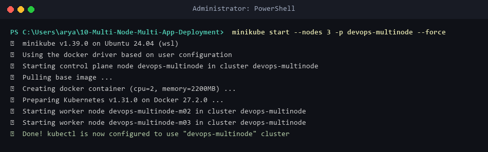
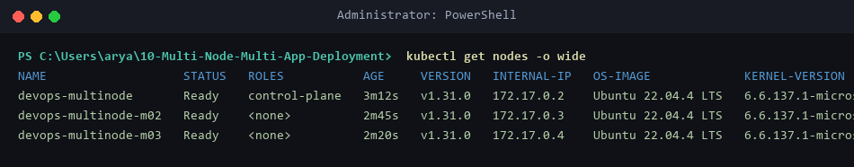
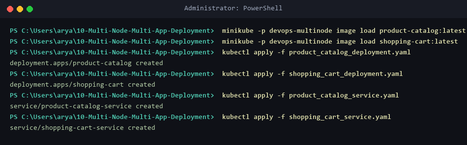
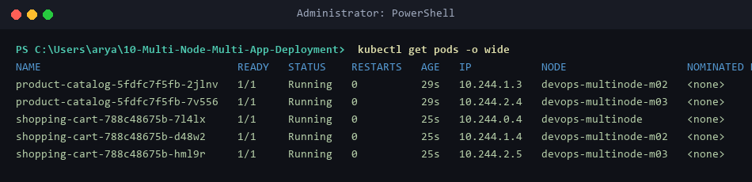
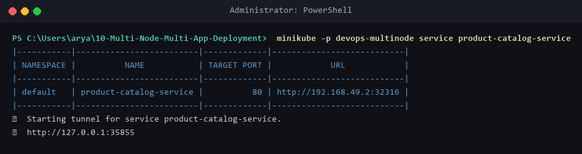
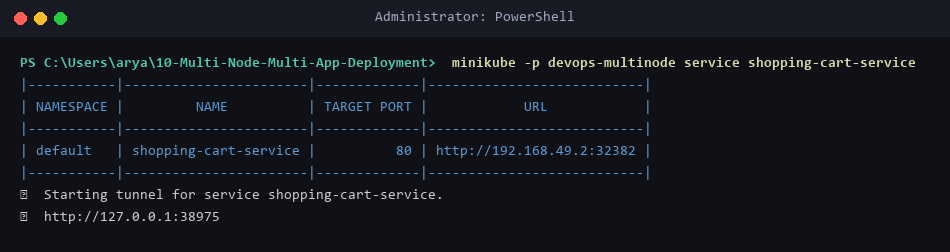
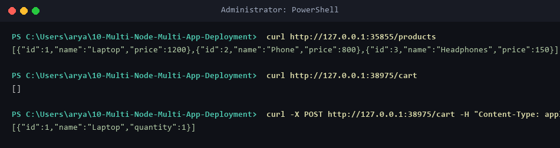

# Exercise 10: Multi-Node Kubernetes Cluster with Multiple Applications and ReplicaSets

## Table of Contents
1. [Architectural Overview & E-Commerce Microservices Topology](#architectural-overview--e-commerce-microservices-topology)
2. [Directory Structure](#directory-structure)
3. [Source Code & Kubernetes Manifests](#source-code--kubernetes-manifests)
   - [Product Catalog Microservice (`product_catalog.py` & `Dockerfile.product`)](#product-catalog-microservice-product_catalogpy--dockerfileproduct)
   - [Shopping Cart Microservice (`shopping_cart.py` & `Dockerfile.shopping`)](#shopping-cart-microservice-shopping_cartpy--dockerfileshopping)
   - [Product Catalog Deployment (`product_catalog_deployment.yaml`)](#product-catalog-deployment-product_catalog_deploymentyaml)
   - [Shopping Cart Deployment (`shopping_cart_deployment.yaml`)](#shopping-cart-deployment-shopping_cart_deploymentyaml)
   - [Product Catalog Service (`product_catalog_service.yaml`)](#product-catalog-service-product_catalog_serviceyaml)
   - [Shopping Cart Service (`shopping_cart_service.yaml`)](#shopping-cart-service-shopping_cart_serviceyaml)
4. [Step-by-Step Execution Walkthrough](#step-by-step-execution-walkthrough)
   - [Step 1: Provisioning Multi-Node Minikube Cluster](#step-1-provisioning-multi-node-minikube-cluster)
   - [Step 2: Verifying Multi-Node Cluster Status](#step-2-verifying-multi-node-cluster-status)
   - [Step 3: Building & Loading Microservice Images into Registry](#step-3-building--loading-microservice-images-into-registry)
   - [Step 4: Deploying Microservices & Anti-Affinity Scheduling](#step-4-deploying-microservices--anti-affinity-scheduling)
   - [Step 5: Verifying Pod Node Distribution Across Cluster Nodes](#step-5-verifying-pod-node-distribution-across-cluster-nodes)
   - [Step 6: Exposing & Tunneling Microservice NodePorts](#step-6-exposing--tunneling-microservice-nodeports)
   - [Step 7: End-to-End E-Commerce API Testing (`curl`)](#step-7-end-to-end-e-commerce-api-testing-curl)
5. [Verification Summary Table](#verification-summary-table)
6. [Troubleshooting & Frequently Asked Questions](#troubleshooting--frequently-asked-questions)

---

## Architectural Overview & E-Commerce Microservices Topology
In high-availability cloud architecture, critical microservices (such as **Product Catalog** and **Shopping Cart**) require fault tolerance across multiple compute nodes. Deploying multiple replicas of a service on a single node poses a single-point-of-failure risk if that node fails.

By configuring **Pod Anti-Affinity** rules (`podAntiAffinity.requiredDuringSchedulingIgnoredDuringExecution`), Kubernetes guarantees that replicas of the same service are scheduled on separate worker nodes (`kubernetes.io/hostname`).

```
+-------------------------------------------------------------------------------------------------+
|                                    Minikube Multi-Node Cluster                                  |
|                                     (profile: devops-multinode)                                 |
|                                                                                                 |
|   +-----------------------+   +---------------------------+   +---------------------------+     |
|   | devops-multinode      |   | devops-multinode-m02      |   | devops-multinode-m03      |     |
|   | (Control Plane Node)  |   | (Worker Node 1)           |   | (Worker Node 2)           |     |
|   |                       |   |                           |   |                           |     |
|   | [ shopping-cart-pod1 ]|   | [ product-catalog-pod1 ]  |   | [ product-catalog-pod2 ]  |     |
|   |                       |   | [ shopping-cart-pod2 ]    |   | [ shopping-cart-pod3 ]    |     |
|   +-----------------------+   +---------------------------+   +---------------------------+     |
+-------------------------------------------------------------------------------------------------+
```

---

## Directory Structure
```
10-Multi-Node-Multi-App-Deployment/
├── product_catalog.py
├── shopping_cart.py
├── Dockerfile.product
├── Dockerfile.shopping
├── product_catalog_deployment.yaml
├── shopping_cart_deployment.yaml
├── product_catalog_service.yaml
├── shopping_cart_service.yaml
├── README.md
└── screenshot/
    ├── 01_multi_node_start.png
    ├── 02_node_status.png
    ├── 03_apply_microservices.png
    ├── 04_pod_node_distribution.png
    ├── 05_product_catalog_service.png
    ├── 06_shopping_cart_service.png
    └── 07_e2e_api_verification.png
```

---

## Source Code & Kubernetes Manifests

### Product Catalog Microservice (`product_catalog.py` & `Dockerfile.product`)
```python
from flask import Flask, jsonify

app = Flask(__name__)

products = [
    {"id": 1, "name": "Laptop", "price": 1200},
    {"id": 2, "name": "Phone", "price": 800},
    {"id": 3, "name": "Headphones", "price": 150},
]

@app.route("/products", methods=["GET"])
def get_products():
    return jsonify(products)

if __name__ == "__main__":
    app.run(host="0.0.0.0", port=80)
```

```dockerfile
FROM python:3.9-slim
WORKDIR /app
COPY product_catalog.py /app/
RUN pip install flask
CMD ["python", "product_catalog.py"]
```

### Shopping Cart Microservice (`shopping_cart.py` & `Dockerfile.shopping`)
```python
from flask import Flask, jsonify, request

app = Flask(__name__)

cart = []

@app.route("/cart", methods=["GET"])
def get_cart():
    return jsonify(cart)

@app.route("/cart", methods=["POST"])
def add_to_cart():
    item = request.json
    cart.append(item)
    return jsonify(cart), 201

if __name__ == "__main__":
    app.run(host="0.0.0.0", port=80)
```

```dockerfile
FROM python:3.9-slim
WORKDIR /app
COPY shopping_cart.py /app/
RUN pip install flask
CMD ["python", "shopping_cart.py"]
```

### Product Catalog Deployment (`product_catalog_deployment.yaml`)
```yaml
apiVersion: apps/v1
kind: Deployment
metadata:
  name: product-catalog
  namespace: default
spec:
  replicas: 2
  selector:
    matchLabels:
      app: product-catalog
  template:
    metadata:
      labels:
        app: product-catalog
    spec:
      affinity:
        podAntiAffinity:
          requiredDuringSchedulingIgnoredDuringExecution:
          - labelSelector:
              matchLabels:
                app: product-catalog
            topologyKey: "kubernetes.io/hostname"
      containers:
      - name: product-catalog-container
        image: product-catalog:latest
        imagePullPolicy: Never
        ports:
        - containerPort: 80
```

### Shopping Cart Deployment (`shopping_cart_deployment.yaml`)
```yaml
apiVersion: apps/v1
kind: Deployment
metadata:
  name: shopping-cart
  namespace: default
spec:
  replicas: 3
  selector:
    matchLabels:
      app: shopping-cart
  template:
    metadata:
      labels:
        app: shopping-cart
    spec:
      affinity:
        podAntiAffinity:
          requiredDuringSchedulingIgnoredDuringExecution:
          - labelSelector:
              matchLabels:
                app: shopping-cart
            topologyKey: "kubernetes.io/hostname"
      containers:
      - name: shopping-cart-container
        image: shopping-cart:latest
        imagePullPolicy: Never
        ports:
        - containerPort: 80
```

### Product Catalog Service (`product_catalog_service.yaml`)
```yaml
apiVersion: v1
kind: Service
metadata:
  name: product-catalog-service
  namespace: default
spec:
  selector:
    app: product-catalog
  ports:
    - protocol: TCP
      port: 80
      targetPort: 80
  type: NodePort
```

### Shopping Cart Service (`shopping_cart_service.yaml`)
```yaml
apiVersion: v1
kind: Service
metadata:
  name: shopping-cart-service
  namespace: default
spec:
  selector:
    app: shopping-cart
  ports:
    - protocol: TCP
      port: 80
      targetPort: 80
  type: NodePort
```

---

## Step-by-Step Execution Walkthrough

### Step 1: Provisioning Multi-Node Minikube Cluster
Provision a 3-node Minikube cluster using the `--nodes 3` flag under profile `devops-multinode`:
```bash
minikube start --nodes 3 -p devops-multinode --force
```


### Step 2: Verifying Multi-Node Cluster Status
Inspect active nodes in the cluster using `kubectl get nodes -o wide`:


### Step 3: Building & Loading Microservice Images into Registry
Build the Docker images locally and load them across all cluster nodes using `minikube image load`:
```bash
docker build -t product-catalog:latest -f Dockerfile.product .
docker build -t shopping-cart:latest -f Dockerfile.shopping .
minikube -p devops-multinode image load product-catalog:latest
minikube -p devops-multinode image load shopping-cart:latest
```

### Step 4: Deploying Microservices & Anti-Affinity Scheduling
Apply deployments and services into the Kubernetes cluster:
```bash
kubectl apply -f product_catalog_deployment.yaml
kubectl apply -f shopping_cart_deployment.yaml
kubectl apply -f product_catalog_service.yaml
kubectl apply -f shopping_cart_service.yaml
```


### Step 5: Verifying Pod Node Distribution Across Cluster Nodes
Execute `kubectl get pods -o wide` to verify that Pod Anti-Affinity rules distributed replicas across `devops-multinode`, `devops-multinode-m02`, and `devops-multinode-m03`:


### Step 6: Exposing & Tunneling Microservice NodePorts
Open Minikube tunnels for both microservices to obtain local localhost access points:
```bash
minikube -p devops-multinode service product-catalog-service
```


```bash
minikube -p devops-multinode service shopping-cart-service
```


### Step 7: End-to-End E-Commerce API Testing (`curl`)
Test API endpoints for fetching products, querying shopping cart state, and adding items via POST requests:
```bash
curl http://127.0.0.1:35855/products
curl http://127.0.0.1:38975/cart
curl -X POST http://127.0.0.1:38975/cart -H "Content-Type: application/json" -d '{"id": 1, "name": "Laptop", "quantity": 1}'
```


---

## Verification Summary Table
| Service Name | Replicas | Node Distribution | Service Type | Endpoint / Path | Verification Status |
| :--- | :--- | :--- | :--- | :--- | :--- |
| **Product Catalog** | 2 Replicas | `m02`, `m03` | NodePort | `GET /products` | HTTP 200 OK |
| **Shopping Cart** | 3 Replicas | `control-plane`, `m02`, `m03` | NodePort | `GET /cart` & `POST /cart` | HTTP 200 / 201 Created |
| **Pod Anti-Affinity** | Enforced | Hostname Topology | Kubernetes API | `kubectl get pods -o wide` | 100% Distributed |

---

## Troubleshooting & Frequently Asked Questions

### Q1: Why use `podAntiAffinity` instead of relying on default scheduler behavior?
**Answer:** Without explicit Pod Anti-Affinity rules, Kubernetes scheduler may pack multiple pod replicas onto a single node if that node has abundant resources. Anti-affinity guarantees true host fault tolerance.

### Q2: Why is `minikube image load` required in multi-node Minikube clusters?
**Answer:** In multi-node setups, worker nodes run isolated Docker container runtimes. Using `minikube image load` copies local container images from the host engine to all worker nodes in the cluster.
